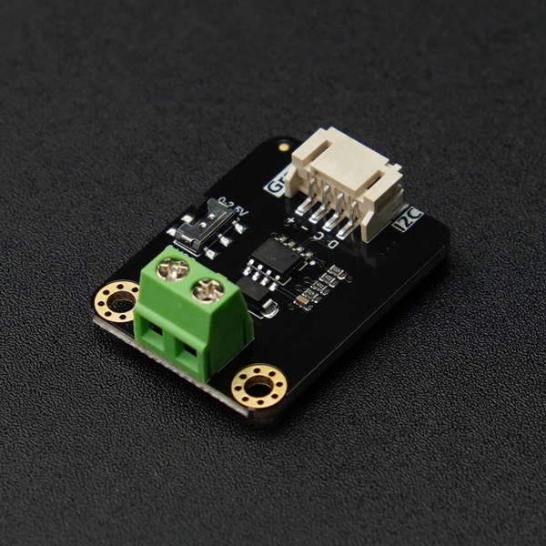

# DFRobot_GP8XXX

* [中文版](./README_CN.md)

GP8XXX series driver libraries for Arduino IDE (currently compatible with GP8101, GP8211S, GP8413, GP8501, GP8503, GP8512, GP8403, GP8302, GP8600, GP8630N)  



## Product Link (https://www.dfrobot.com.cn/goods-3786.html)

SKU：

1. DFR1034 --- GP8503
2. DFR1035 --- GP8512
3. DFR1036 --- GP8101S
4. DFR1037 --- GP8501
5. DFR1071 --- GP8211S
6. DFR1073 --- GP8413
7. DFR0971 --- GP8403
8. DFR0972 --- GP8302 
9. DFR1229 --- GP8600  
10. DFR1230 --- GP8630N  

## Table of Contents

  - [Summary](#summary)
  - [Installation](#installation)
  - [Methods](#methods)
  - [Compatibility](#compatibility)
  - [History](#history)
  - [Credits](#credits)

## Summary
    This library has already provided sample demos for each of the 11 currently compatible products, and users can use them according to their names
## Installation

There two methods: 
1. To use this library, first download the library file, paste it into the \Arduino\libraries directory, then open the examples folder and run the demo in the folder.
2. Search the DFRobot_GP8XXX library from the Arduino Software Library Manager and download it.

## Methods

```C++

/**************************************************************************
                                  PWM Series
 **************************************************************************/

    /**
     * @fn begin
     * @brief Initialize the function
     * @return 0
     */
    int begin();

    /**
     * @fn setDACOutVoltage
     * @brief Set different channel output DAC values, module outputs corresponding voltage values
     * @param data PWM pulse width
     * @param channel output channel
     * @n 0: Channel 0 (valid when PWM0 output is configured)
     * @n 1: Channel 1 (valid when PWM1 output is configured)
     * @n 2: All channels (valid when configuring dual channel output)
     * @return NONE
     */
    void setDACOutVoltage(uint16_t data, uint8_t channel=0);

    /**
     * @fn setDACOutElectricCurrent
     * @brief Set DAC output value, module outputs corresponding current
     * @param data PWM pulse width
     * @return NONE
     */
    void setDACOutElectricCurrent(uint16_t data);

/**************************************************************************
                                  I2C Series
 **************************************************************************/
    /**
     * @fn begin
     * @brief initialization function
     * @return returns 0 for success, and other values for failure 
     */
    int begin(void);

    /**  
     * @fn setDACOutRange  
     * @brief Configure DAC output range  
     * @param range Output range options:  
     * @n  eOutputRange5V(0-5V)
     * @n  eOutputRange10V(0-10V)    
     * @return NONE
     */  
    void setDACOutRange(eOutPutRange_t range);

    /**
     * @fn setDACOutVoltage
     * @brief Set different channel output DAC values
     * @param data value corresponding to the voltage value
     * @param channel output channel
     * @n 0: Channel 0 (valid when PWM0 output is configured)
     * @n 1: Channel 1 (valid when PWM1 output is configured)
     * @n 2: All channels (valid when configuring dual channel output)
     * @return NONE
     */
    void setDACOutVoltage(uint16_t data, uint8_t channel=0);
  
    /**
     * @fn store
     * @brief Save the set voltage inside the chip
     * @return NONE
     */
    void store(void);

/**************************************************************************
                                  I2C & PWM Series
 **************************************************************************/
    /**
     * @fn begin
     * @brief Initialize the function
     * @return returns 0 for success, and other values for failure 
     */
    int begin(void);

    /**
     * @fn setDACOutRange
     * @brief Set DAC output range
     * @param range DAC output range
     * @n  eOutputRange5V(0-5V)
     * @n  eOutputRange6V(0-6V)       GP8630N、GP8600
     * @n  eOutputRange10V(0-10V)     
     * @n  eOutputRange_10V(-10-0V)   GP8630N
     * @n  eOutputRange_12V(-12-0V)   GP8630N
     * @n  eOutputRange12V(0-12V)     GP8630N、GP8600
     * @n  eOutputRange20MA(0-20mA)
     * @n  eOutputRange24MA(0-24mA)   GP8630N  
     * @return NONE
     */  
    void setDACOutRange(eOutPutRange_t range);

    /**
     * @fn setDACOutData
     * @brief Set single channel module output DAC value
     * @param data data DAC value
     * @n  In PWM mode, data ranges from 0~255 (0~1023 for ESP32/ESP8266 platforms), representing PWM duty cycle (0~100%)
     * @n  In PWM mode, current/voltage output range is selected via DIP switches according to silkscreen on module back
     * @n  In I2C mode, data ranges from 0~65535, directly corresponding to voltage or current values within the set range
     * @n  In I2C mode, output current/voltage values are determined by the range setviasetDACOutRange()
     * @return NONE
     */

    void setDACOutData(uint16_t data);

```

## Compatibility

MCU                |  Work Well   | Work Wrong   | Untested    | Remarks
------------------ | :----------: | :----------: | :---------: | -----
Arduino Uno        |      √       |              |             | 
Mega2560           |      √       |              |             | 
Leonardo           |      √       |              |             | 
ESP32              |      √       |              |             | 
ESP8266            |      √       |              |             | 
micro:bit          |      √       |              |             | 
FireBeetle M0      |      √       |              |             | 

## History

- 2023/5/10 - Version 1.0.0 released.
- 2025/9/3  - Version 1.1.0 released. add GP8600, GP8630N
## Credits

- Written by fary( feng.yang@dfrobot.com), 2023. (Welcome to our [website](https://www.dfrobot.com/))
- Written by lr  ( rong.li@dfrobot.com),   2025. (Welcome to our [website](https://www.dfrobot.com/))